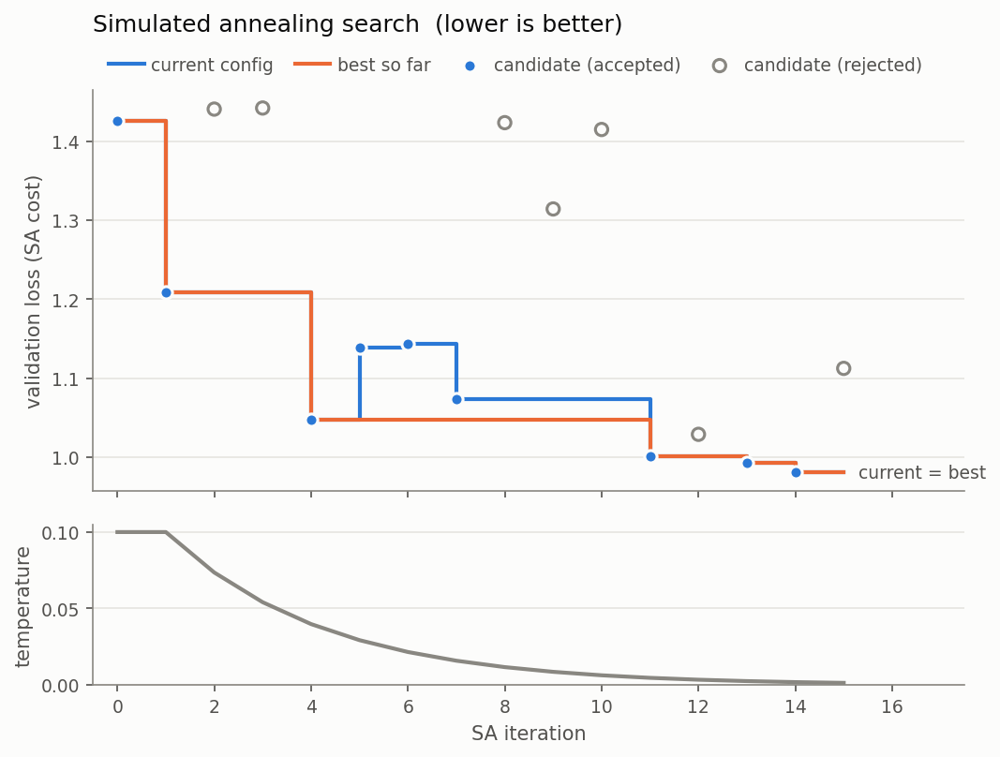

# BERT BoSA
### Bidirectional Encoder Representations from Transformers using Boltzmann Simulated Annealing

[](https://colab.research.google.com/github/jeorgexyz/BERT-BoSA/blob/main/BERT_BoSA_Colab.ipynb)

BERT BoSA trains a BERT-style transformer encoder from scratch for text classification, using Simulated Annealing to search over training hyperparameters. The SA search perturbs the **learning rate**, **dropout rate**, and **number of encoder layers**, scoring each candidate by training a fresh model for a fixed number of batches and measuring its cross-entropy loss on a held-out validation split. The best configuration found is then used for the full training run.

Note that this is the BERT *architecture* trained directly on the classification task — there is no masked-language-model pretraining — so expect from-scratch accuracy rather than pretrained-BERT numbers. For context, simple bag-of-embeddings baselines reach about 92% on AG_NEWS; this repo exists to demonstrate SA-driven hyperparameter search, not to beat them.

## Requirements

- Python 3.8 or later
- PyTorch
- HuggingFace `datasets` (for AG_NEWS)
- matplotlib (only for `plot_sa.py`)

Install into a virtual environment so the project doesn't share packages with your system Python:

```
python -m venv .venv
.venv\Scriptsctivate        # Windows
source .venv/bin/activate     # macOS / Linux
pip install -r requirements.txt
```

The CPU build of PyTorch installs by default. For a CUDA build, follow the selector at [pytorch.org](https://pytorch.org/get-started/locally/).

## Dataset

The AG_NEWS dataset (4-class news topic classification) is downloaded automatically via the HuggingFace `datasets` library (`fancyzhx/ag_news`) on first run and cached locally. 5% of the training set is held out as a validation split, used by the SA search and for per-epoch monitoring; the vocabulary is built from the remaining training texts.

## Folder Structure

```
BERT-BoSA/
├── models/
│   ├── bert.py                  # embeddings + transformer encoder (with padding mask)
│   └── classification_head.py   # dropout + linear over the [CLS] token
├── utils/
│   ├── data_utils.py            # dataset loading, vocab, dataloaders
│   └── train_utils.py           # shared accuracy computation
├── optimization/
│   └── simulated_annealing.py   # SA search + candidate evaluation
├── config.py                    # initial + fixed hyperparameters
├── train.py                     # SA search, full training, checkpointing
├── eval.py                      # test-set evaluation of a checkpoint
├── plot_sa.py                   # plots the SA trace from sa_log.csv
├── docs/                        # sample run: trace CSV + plot
├── BERT_BoSA_Colab.ipynb        # end-to-end run on a Colab GPU
├── requirements.txt
├── LICENSE
└── README.md
```

## Usage

1. **Configuration**: `config.py` holds the initial values of the SA-optimizable parameters (`initial_config`) and the fixed hyperparameters (`FIXED_CONFIG`).

2. **Training**:

   ```
   python train.py
   ```

   This runs the SA search, retrains with the best configuration found, and saves the model weights, configuration, and vocabulary to `model.pt`. Useful flags:

   ```
   --sa-iterations N     SA iterations (default 15)
   --sa-train-batches N  training batches per SA candidate (default 300)
   --skip-sa             skip the search and train with the initial config
   --epochs N            epochs for the final training run
   --seed N              random seed (default 42)
   --output PATH         checkpoint path (default model.pt)
   --sa-log PATH         per-iteration SA trace CSV (default sa_log.csv)
   ```

   Each SA iteration trains a candidate model for `--sa-train-batches` batches, so the search cost scales with both flags. Candidate evaluations use a fixed seed so configs are compared under identical initialisation and batch order. The cooling rate is derived from `--sa-iterations` so the temperature always decays from 0.1 to 0.001 over the full run.

   **Runtime:** the default model (8 layers, 512-dim) takes roughly 2 s per batch on a modern CPU, so a full run is many hours without a GPU. Use `--skip-sa`, fewer `--sa-iterations`/`--sa-train-batches`, or shrink `embedding_dim`/`n_layers` in `config.py` to experiment on CPU.

3. **Evaluation**:

   ```
   python eval.py --checkpoint model.pt
   ```

   This restores the model and its training vocabulary from the checkpoint and reports accuracy on the AG_NEWS test set.

4. **Plotting the search**:

   ```
   python plot_sa.py --log sa_log.csv --output sa_trace.png
   ```

   Plots validation accuracy of each candidate (accepted vs. rejected), the current and best-so-far configs, and the temperature schedule.

**No GPU?** Use the Colab badge at the top — the notebook runs all of the above on a free Colab GPU and lets you download the plot and logs.

## Results

A full run on a Colab T4 (15 SA iterations × 300 batches per candidate, then 3 epochs on the winner):



The search drops validation loss from 1.43 to 0.98 (candidate accuracy 26% → 60%). Note iterations 5–6: uphill moves accepted while the temperature is still high, exactly what SA is supposed to do. Rejections cluster later, as `T` cools and the search turns greedy. The full trace is in [`docs/sa_log.csv`](docs/sa_log.csv).

```
SA iter   4: candidate loss=1.0472 acc=0.5656 (accepted)  cost=1.0472  best=1.0472  temp=0.0398
SA iter   5: candidate loss=1.1386 acc=0.5506 (accepted)  cost=1.1386  best=1.0472  temp=0.0293
...
SA iter  13: candidate loss=0.9929 acc=0.6200 (accepted)  cost=0.9929  best=0.9929  temp=0.0025
SA iter  14: candidate loss=0.9803 acc=0.6044 (accepted)  cost=0.9803  best=0.9803  temp=0.0018
SA iter  15: candidate loss=1.1124 acc=0.5375 (rejected)  cost=0.9803  best=0.9803  temp=0.0014

Best config: learning_rate=7.37e-05, dropout=0.168, n_layers=5

Epoch 1/3  loss=0.6357  train_acc=0.7529  val_acc=0.8667
Epoch 2/3  loss=0.4118  train_acc=0.8566  val_acc=0.8808
Epoch 3/3  loss=0.3570  train_acc=0.8762  val_acc=0.8783
Test Accuracy: 0.8734
```

**The honest result: the searched config did slightly worse than the starting one.** SA picked a 5-layer model (87.34% test accuracy); the untuned 8-layer default reached 88.08% in an earlier run. This is short-horizon bias in action — 300 batches rewards the model that learns *fastest*, not the one that ends up best after three full epochs. Lengthening the candidate budget, or ranking finalists with a longer run, is the standard fix, and it costs proportionally more search time. The search is doing its job correctly; the objective it is given is simply an imperfect proxy for the one you care about.

## Customization

- **Dataset**: To use a different text classification dataset, modify `_load_ag_news` in `utils/data_utils.py` and update `num_classes` in `config.py`.
- **Model**: `models/bert.py` and `models/classification_head.py` define the architecture.
- **Search space**: `make_random_perturbation` in `optimization/simulated_annealing.py` defines which hyperparameters SA explores and how they are perturbed.

## How the search works

Each SA step perturbs one hyperparameter (learning rate ×[0.5, 2] clamped to [1e-5, 1e-3]; dropout ±0.1 clamped to [0, 0.5]; layers ±2 clamped to [1, 16]) and scores the candidate by its validation cross-entropy. A better candidate is always accepted; a worse one is accepted with the Boltzmann/Metropolis probability `exp(−Δcost / T)` — the "Boltzmann" in the name. A starting temperature of 0.1 accepts a 0.05 loss regression with probability ≈ 0.6, letting the search escape local optima early and becoming greedy as `T` cools.

**Why loss and not accuracy?** Accuracy is too coarse a ruler for weakly-trained models. With a 100-batch budget every candidate still predicts a single class and scores exactly chance (0.2556 on AG_NEWS), so an accuracy-based cost is *identical* for every config, every candidate is accepted, and the search degenerates into a random walk. Validation loss separates candidates immediately. The trace CSV records accuracy too, for reference.

## Known limitations

- **Short-horizon bias**: candidates are scored after only `--sa-train-batches` steps, which favours configs that learn fast (shallower models, higher learning rates) over those that would win with full training.
- **The search budget must be large enough to separate configs.** Too few batches and every candidate sits at chance accuracy with near-identical loss; the accepted/rejected pattern in the plot is the quickest way to spot this.
- **Segment embeddings** are included for fidelity to BERT but are always zero, since classification inputs are single sentences.
- **Head dropout** is fixed at 0.1 and is not part of the SA search space.
- **No pretraining, warmup, or LR schedule** — deliberate, to keep the code small and focused on the search.

## License

MIT — see [LICENSE](LICENSE).
